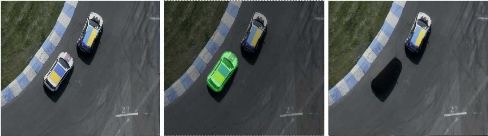
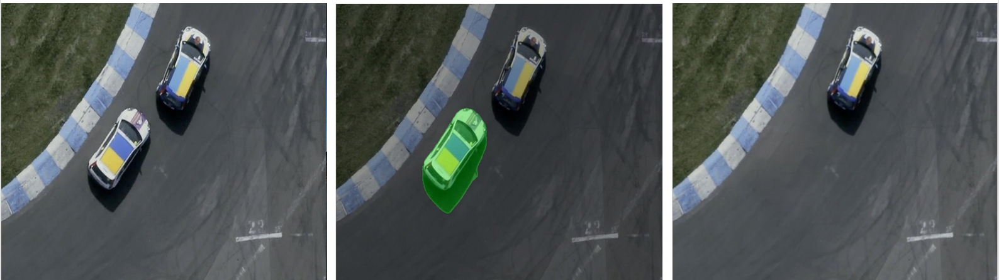
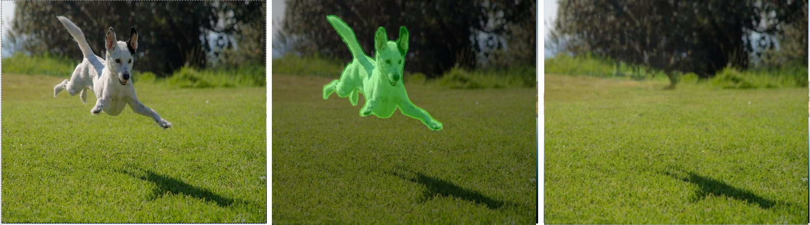
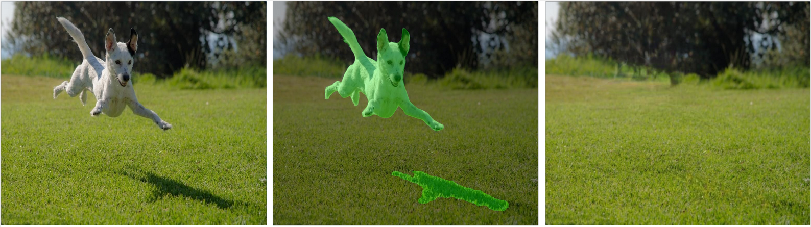

## TL;DR

This repository is a research fork of MobileSAM focused on fine-tuning
segmentation models to explicitly handle visual artifacts such as
shadows and reflections. The resulting models improve object removal
quality in mobile inpainting pipelines by enabling artifact-aware
segmentation.

## Origin of the Repository

This repository is a research fork of the original MobileSAM project:
https://github.com/ChaoningZhang/MobileSAM


## Motivation

In object removal pipelines, segmentation models are typically trained
to isolate foreground objects only. However, in real-world images,
objects are often accompanied by visual artifacts such as shadows
and reflections.

If these artifacts are not explicitly segmented, they remain in the
image after inpainting, leading to visually implausible results.

This repository explores artifact-aware fine-tuning of MobileSAM
to improve downstream object removal quality in mobile applications.

## Datasets and Data Preparation

Fine-tuning of the MobileSAM model in this repository was performed using
datasets containing explicit annotations of visual artifacts such as
shadows and reflections, in addition to foreground object masks.

The following datasets were used:

### Used Datasets

- **SOBA**  
  Dataset containing objects and its related shadows  can be found in this repo:
  https://github.com/stevewongv/InstanceShadowDetection

- **DEROBA**  
  Dataset providing object with its reflection.  
  https://github.com/bcmi/Object-Reflection-Generation-Dataset-DEROBA


### Dataset Preparation

The original datasets are not directly compatible with the MobileSAM
training pipeline. Therefore, custom data preparation scripts are
provided to convert raw annotations into an artifact-aware format
suitable for fine-tuning.

- `mobile_sam/data_preparation/prepare_soba.py`  
  Converts the SOBA dataset into an artifact-aware training format by
  extracting shadow masks and aligning them with object regions.

- `mobile_sam/data_preparation/prepare_deroba.py`  
  Converts the DEROBA dataset into an artifact-aware training format by
  generating reflection-aware masks and unifying annotation structure.

### Expected Dataset Structure

Each prepared dataset is expected to follow the directory structure below:

```
dataset_root/
├── images/
│   ├── 0001.jpg
│   ├── 0002.jpg
│   └── ...
├── masks/
│   ├── 0001.png
│   ├── 0002.png
│   └── ...
└── object_masks/
    ├── 0001.png
    ├── 0002.png
    └── ...
```

### Using Custom Datasets

Custom datasets can be used by preparing data in the same directory
structure and providing both artifact-aware masks and object-only masks.

This separation allows experimenting with different supervision schemes
without modifying the training pipeline.

## Qualitative Results

<table>
<tr>
  <td>
    <em>Baseline segmentation (artifact remains)
  </td>
  <td>
  <em>Artifact-aware segmentation</em>
  </td>
</tr>
  <tr>
    <td align="center">
      <br/>
    </td>
    <td align="center">
      <br/>
    </td>
  </tr>
  <tr>
    <td align="center">
      <br/>
    </td>
    <td align="center">
      <br/>
    </td>
  </tr>
  <tr>
    <td align="center">
      <br/>
    </td>
    <td align="center">
      <br/>
    </td>
  </tr>
  <tr>
    <td align="center">
      <br/>
    </td>
    <td align="center">
      <br/>
    </td>
  </tr>
</table>


## Installation and Dependencies

This repository uses **uv** for dependency management.

To install all required dependencies:

```bash
uv venv
source .venv/bin/activate
uv sync
```

## Training Overview

The training process consists of:
1. dataset preparation with artifact-aware masks
2. fine-tuning MobileSAM 
3. optional model optimization (pruning / QAT)
4. export to ONNX for downstream deployment

## Model Optimization (Pruning and Quantization)

As part of the research the fine-tuned MobileSAM models 
were further optimized for mobile deployment using:

- structured and unstructured weight pruning
- quantization-aware training (QAT)

These techniques were applied to reduce model size and inference cost
while preserving segmentation quality, particularly in artifact-aware
scenarios.

## Configuration

Training, optimization, and export parameters are controlled via
configuration files to enable systematic experimentation and
reproducibility.

The configuration mechanism allows adjusting, among others:
- dataset paths and preprocessing options
- training and fine-tuning settings
- optimization flags (e.g. pruning, quantization)
- export and deployment parameters

example of a config can be found here: `configs/config.yaml`

## ONNX Export

This repository supports exporting **both components of MobileSAM**
to the ONNX format:

- image encoder
- prompt encoder + mask decoder

This enables fully on-device inference pipelines, where image embeddings
can be computed once and reused for multiple prompts.

### Exporting the Prompt Encoder and Mask Decoder

The prompt encoder and mask decoder can be exported using the original
MobileSAM export script:

```bash
python scripts/export_onnx_model.py \
  --checkpoint weights/mobile_sam.pt \
  --model-type vit_t \
  --output weights/mobile_sam_decoder.onnx \
  --return-single-mask
```

To export the image encoder:

```bash
python scripts/export_image_encoder_onnx.py \
  --checkpoint weights/mobile_sam.pt \
  --model-type vit_t \
  --output weights/mobile_sam_image_encoder.onnx
```
